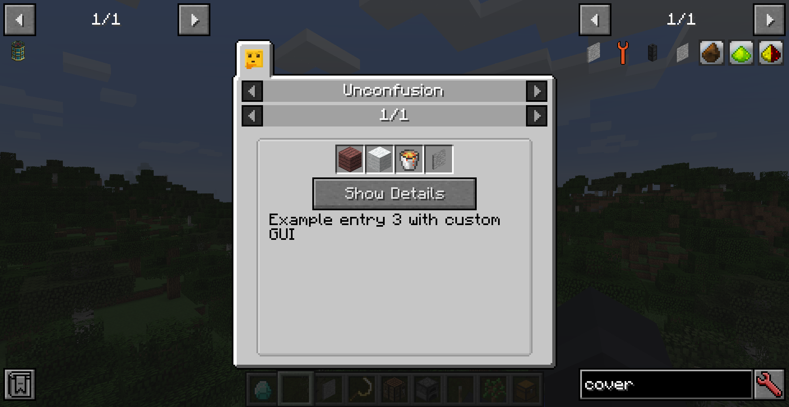
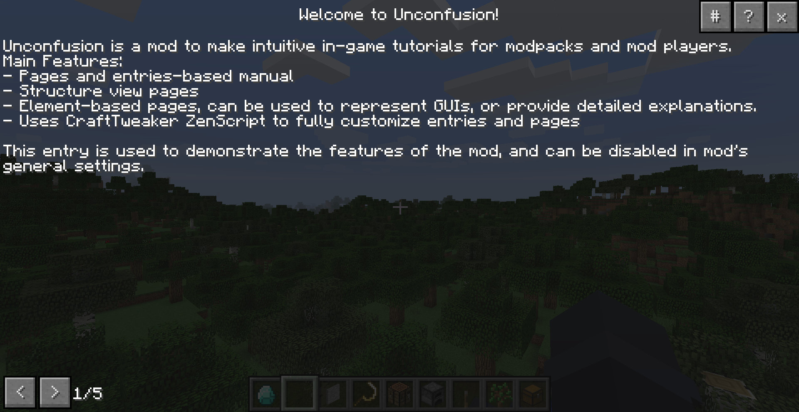
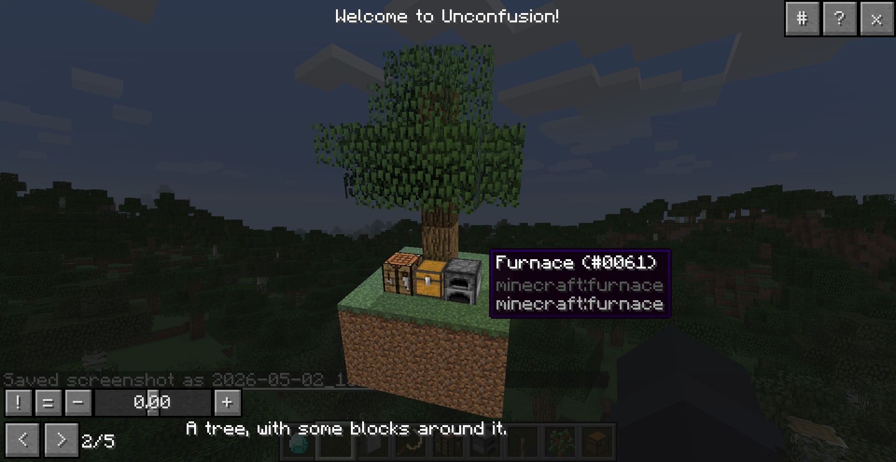
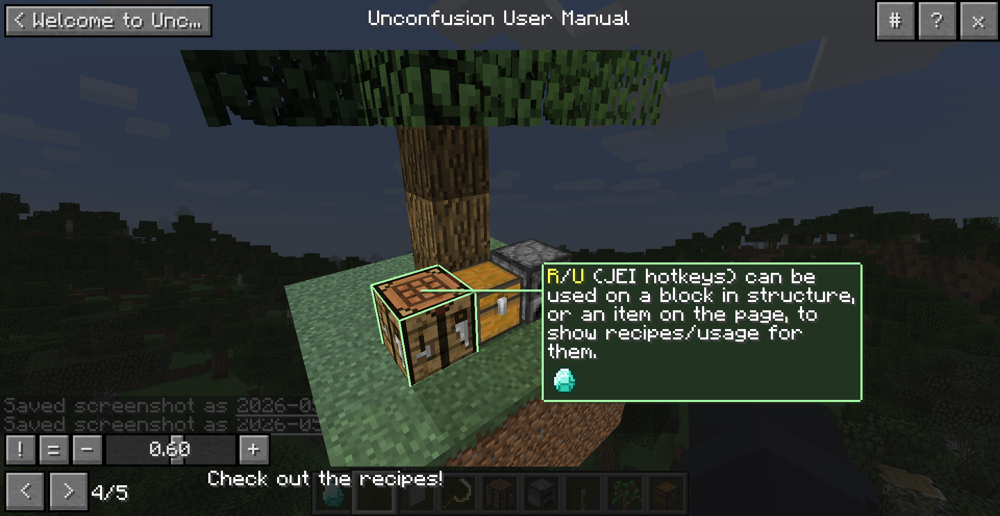
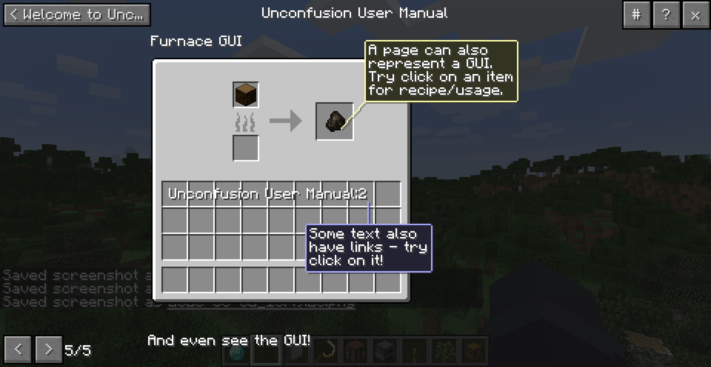

## Unconfusion
A mod to make intuitive in-game tutorials for modpacks and mod players, inspired by Ponder from Creators of Create.  

Features:
- Paged manual entries  
- Structure view pages  
- Element-based pages, can be used to represent GUIs, or provide detailed explanations.  
- Uses CraftTweaker ZenScript to create entries and pages  
- Support ZenUtils' hot reload feature (note that JEI entries needs restart to take effect)

Notes:
- In structure view, certain special blocks from some mods may not render properly.  
- This is because the structure is loaded in a single dummy world that doesn't have normal client-server structure, so some blocks with custom render relying on it can break.  
- This mod has a few compatibility modules built-in, to fix/optimize some known ones.  

Builtin compatibility fixes:
- IC2 TileEntities (render fix)
- EnderIO cable (render fix)
- BuildCraft TileEntities (savedata optimization)
- ForgeMultiPart CBE Microblocks (render fix)

Screenshots:

